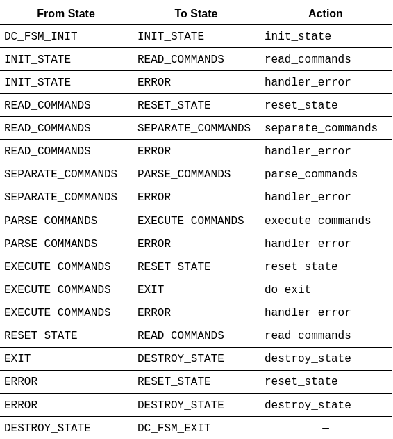
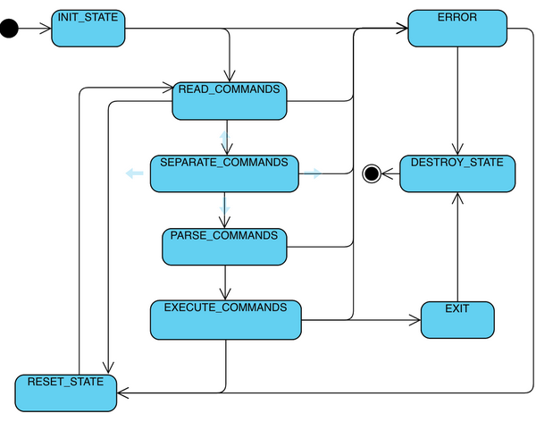

## Setup
```
mkdir cmake-build-debug
```

## Source Code Additions
```
cmake -DCMAKE_C_COMPILER="gcc" -DCMAKE_CXX_COMPILER="g++" -S . -B cmake-build-debug
```
## Build 
Examples:
```
cmake --build cmake-build-debug
cmake --build cmake-build-debug --clean-first
cmake --build cmake-build-debug --target docs
cmake --build cmake-build-debug --target format
```
## State Table


## State Transition Diagram


