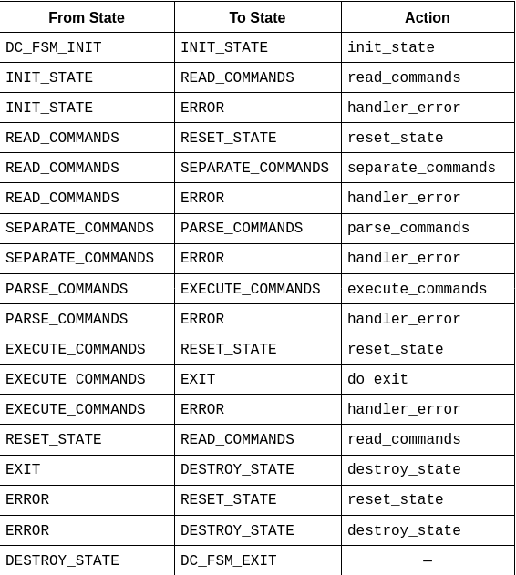
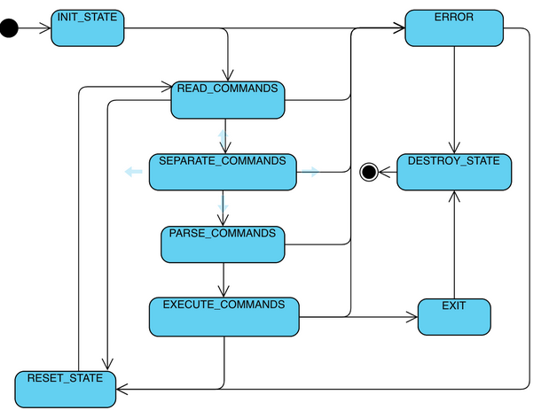

## Table of Contents

- [Table of Contents](#table-of-contents)
- [Pre Setup](#pre-setup)
- [Setup](#setup)
- [Source Code Additions](#source-code-additions)
- [Build](#build)
- [State Table](#state-table)
- [State Transition Diagram](#state-transition-diagram)
- [Examples](#examples)
  - [Start the program](#start-the-program)
  - [Print Working Directory (pwd)](#print-working-directory-pwd)
  - [Change Directory (cd)](#change-directory-cd)
  - [List (ls)](#list-ls)
  - [Redirection (<, >, >>, 2>)](#redirection----2)
  - [Print (cat)](#print-cat)
  - [GCC](#gcc)
  - [Run Output](#run-output)

## Pre Setup

This program will run using DC libraries. DC libraries provide error handling, and error reporting for your POSIX application.

So clone this repository -> [dc_scripts](https://github.com/bcitcstdatacomm/dc_scripts). After that, `cd` into dc_scripts folder and run
`./dc-update work gcc g++` This will install all dc libraries in your folder called work. If you'd like to update your libraries, simply go to dc_scripts folder and run `./dc-update work` to update the libraries.

## Setup

Clone this repository then go to the program's directory then run command:

```
mkdir cmake-build-debug
```

## Source Code Additions

```
cmake -DCMAKE_C_COMPILER="gcc" -DCMAKE_CXX_COMPILER="g++" -S . -B cmake-build-debug
```

## Build

Examples:

```
cmake --build cmake-build-debug
cmake --build cmake-build-debug --clean-first
cmake --build cmake-build-debug --target docs
cmake --build cmake-build-debug --target format
```

## State Table



## State Transition Diagram



## Examples

### Start the program

.png>)

### Print Working Directory (pwd)

.png>)

### Change Directory (cd)

.png>)

### List (ls)

.png>)

### Redirection (<, >, >>, 2>)

.png>)

### Print (cat)

.png>)

### GCC

.png>)

### Run Output

.png>)
